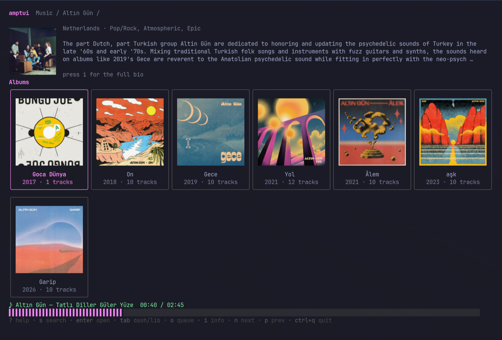

# amptui

A terminal UI music client for Plex and Jellyfin — browse your library,
queue tracks, and play them, all from the keyboard.

Built with [Bubble Tea](https://github.com/charmbracelet/bubbletea), small
hand-written Plex and Jellyfin HTTP clients behind a common backend
interface, and [mpv](https://mpv.io/) for audio playback.



## Status

Working today:

- [x] Connect to a Plex server (manual token auth) or a Jellyfin server (username/password)
- [x] Browse: libraries → artists → albums → tracks (list or grid)
- [x] Dashboard home with recent plays, recently added, recent playlists
- [x] Play via mpv: pause/resume, seek, next/prev, queue with auto-advance
- [x] Queue modal: reorder, delete, jump-to-play, track progress bar
- [x] Fuzzy search across the whole library
- [x] Artist / album info: bio, genres, similar artists (`i` modal)
- [x] Inline artwork — Kitty graphics on supported terminals, half-block fallback everywhere else; lazy-loaded for the on-screen window only
- [x] Editable settings screen, in-app keybindings modal (`?`)
- [x] Pluggable backend — Plex or Jellyfin, selected by config, behind one `media.Backend` interface
- [x] Library cache (`internal/library`) as single source of truth — browse + search read from it; the server is only touched during sync or info fetches
- [ ] Scrobble / mark played

## Roadmap

- **Dashboard improvements** — richer tiles, more sections, better layout.
- **Playlist management** — create, edit, and reorder playlists from the TUI
  (today they're browse + play only).
- **Music visualizer screen** — an audio-reactive view while a track plays.

## Requirements

- Go 1.26+
- [mpv](https://mpv.io/) on your `PATH` (playback is disabled gracefully if missing)
- A music library on either a Plex Media Server (with an `X-Plex-Token`) or a
  Jellyfin server (with a username + password)

## Build

```bash
make build     # produces ./amptui
make run       # build-and-run via `go run`
make install   # `go install` to $GOBIN / $GOPATH/bin so `amptui` is on PATH
make uninstall # remove the installed binary
make           # list all targets
```

Without `make`: `go build -o amptui ./cmd/amptui && ./amptui`, or `go run ./cmd/amptui`,
or `go install ./cmd/amptui` for a system-wide install.

## Configuration

Every setting is editable from inside the app — press `,` to open the
settings screen, `j`/`k` to move, `enter` to edit, `enter` again to save.
First-run with no config drops you straight there so you can pick a backend
and paste in your credentials.

Settings (the required ones depend on the backend — see below):

| Setting             | TOML key              | Values                  | Notes                                                                |
| ------------------- | --------------------- | ----------------------- | -------------------------------------------------------------------- |
| Backend             | `backend`             | `plex` / `jellyfin`     | Which server type to drive. Defaults to `plex`.                      |
| Server URL          | `server_url`          | `http://host:32400`     | Your server. Required. (Jellyfin is usually port `8096`.)            |
| Plex token          | `plex_token`          | `X-Plex-Token`          | **Plex only.** See Plex's [auth token guide](https://support.plex.tv/articles/204059436-finding-an-authentication-token-x-plex-token/). |
| Jellyfin username   | `jellyfin_username`   | account name            | **Jellyfin only.**                                                   |
| Jellyfin password   | `jellyfin_password`   | account password        | **Jellyfin only.** Exchanged for a token + user id at startup.       |
| Default library     | `default_library`     | name or section key     | Skips the library picker on launch.                                  |
| Default view artist | `default_view_artist` | `list` / `grid`         | Initial render mode for the Artists level.                           |
| Default view album  | `default_view_album`  | `list` / `grid`         | Initial render mode for the Albums level.                            |
| Home screen         | `home`                | `library` / `dashboard` | Which screen amptui opens on. `tab` toggles at runtime.              |
| Inline artwork      | `images`              | `false` / `true`        | Render artist / album thumbnails. See [Inline artwork](#inline-artwork). |
| Download folder     | `download_folder`     | path                    | Where `d` saves tracks/albums. Empty disables downloads.            |

**Plex** needs `server_url` + `plex_token`. **Jellyfin** needs `server_url` +
`jellyfin_username` + `jellyfin_password`. Note that Jellyfin has no content-version counter,
so amptui can't auto-detect library changes — press `R` to re-sync the cache
after adding music. Jellyfin bio/genre metadata is also only as complete as
what the server has scraped.

Anything saved in the app is written to `~/.config/amptui/config.toml`. A
hand-edited TOML works too — see `config.example.toml` for the full schema.
Settings can also be overridden via env vars:

```bash
export AMPTUI_BACKEND="jellyfin"
export AMPTUI_SERVER_URL="http://192.168.1.10:8096"
export AMPTUI_PLEX_TOKEN="your-X-Plex-Token-here"   # Plex
export AMPTUI_JELLYFIN_USERNAME="you"               # Jellyfin
export AMPTUI_JELLYFIN_PASSWORD="secret"            # Jellyfin
export AMPTUI_DEFAULT_LIBRARY="Music"
```

### Inline artwork

When **Inline artwork** is on, amptui renders artist and album thumbnails in
the breadcrumb header, the `i` info modal, grid cards, and album list rows.
Rendering picks the best protocol your terminal advertises:

- **Kitty graphics protocol** (pixel-perfect, real images) on:
  [Kitty](https://sw.kovidgoyal.net/kitty/),
  [Ghostty](https://ghostty.org/),
  [WezTerm](https://wezterm.org/),
  Konsole (recent versions). Detection looks at
  `$KITTY_WINDOW_ID`, `$GHOSTTY_RESOURCES_DIR`, `$TERM_PROGRAM`, and `$TERM`.
- **Half-block ANSI fallback** everywhere else (any 24-bit-color terminal
  including Alacritty, foot, tmux, xterm — works over SSH too).

Thumbnails are fetched on demand from the backend (Plex's
`/photo/:/transcode` or Jellyfin's `/Items/{id}/Images/Primary`) and cached
to `~/.cache/amptui/img/` so subsequent views skip the network.
Press `C` from the settings screen to purge the image cache; the **Image
cache** section there shows the current path, file count, and disk size.

## Keybindings

Press `?` in the app for an in-TUI keybindings modal.

| Key                   | Action                                       |
| --------------------- | -------------------------------------------- |
| `enter` / `→` / `l`   | Open selected item / play track              |
| `esc` / `←` / `h`     | Go back                                      |
| `↑` / `↓` / `j` / `k` | Move selection                               |
| `tab`                 | Switch between Dashboard and Library         |
| `/`                   | Filter the current list                      |
| `i`                   | Artist / album info (bio, genres, similar)   |
| `space`               | Pause / resume                               |
| `n` / `p`             | Next / previous in queue                     |
| `<` / `>`             | Seek −10s / +10s                             |
| `,`                   | Open / close the settings screen             |
| `q`                   | Add highlighted track or album to queue      |
| `Q`                   | Open / close the queue modal                 |
| `d`                   | Download highlighted track or album          |
| `D`                   | Open / close the downloads modal             |
| `s`                   | Open the fuzzy search modal                  |
| `?`                   | Open / close the keybindings modal           |
| `R`                   | Re-sync the library cache from the server          |
| `ctrl+c` / `ctrl+q`   | Quit                                         |

**Inside the queue modal:**

| Key         | Action                                     |
| ----------- | ------------------------------------------ |
| `j` / `k`   | Move cursor                                |
| `J` / `K`   | Reorder highlighted track down / up        |
| `d`         | Delete highlighted track                   |
| `enter`     | Jump playback to highlighted track         |
| `Q` / `esc` | Close                                      |

**Inside the search modal:**

| Key         | Action                                          |
| ----------- | ----------------------------------------------- |
| (type)      | Fuzzy search across the whole library           |
| `tab`       | Cycle filter: All / Artists / Albums / Songs    |
| `↑` / `↓`   | Move cursor through results                     |
| `enter`     | Play (track) or jump into (artist/album)        |
| `alt+enter` | Append highlighted track to the queue           |
| `esc`       | Close                                           |

**Inside the settings screen:**

| Key       | Action                                                  |
| --------- | ------------------------------------------------------- |
| `j` / `k` | Move cursor between editable fields                     |
| `enter`   | Edit the highlighted field                              |
| `enter` (while editing) | Save the new value to `config.toml`       |
| `esc`     | Cancel an edit, or close the settings screen            |
| `R`       | Re-sync the library cache from the server                     |
| `C`       | Clear the image cache (disk + terminal Kitty registry)  |

First-time setup (no credentials yet): save your server URL + token in
settings and the app builds its Plex client and kicks off the library
sync immediately — no restart needed. Re-editing those fields after a
successful startup still requires a relaunch; the running app keeps
its existing Plex client.

The library cache is built on first launch (~8s for a 9k-track library),
persisted to `~/.cache/amptui/<sectionUUID>.json`, and invalidated when
Plex's section `contentChangedAt` counter advances. Every subsequent
browse and search reads from this cache — Plex is only contacted during
sync. While syncing, a small spinner appears on the right of the status
bar; the browser opens into the cache once the sync finishes.

## Project layout

```
cmd/amptui/        entrypoint: config → connect → launch UI
internal/config/   TOML + env config loading
internal/plex/     Plex HTTP client (hand-written, no SDK)
internal/player/   mpv subprocess driven over its JSON IPC socket
internal/library/  on-disk cache for a music section (browse + search read from here)
internal/imgcache/ on-disk thumbnail bytes + terminal-protocol detection
internal/tui/      Bubble Tea drill-down browser
```

## License

MIT
